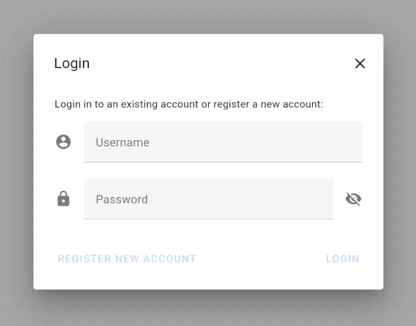
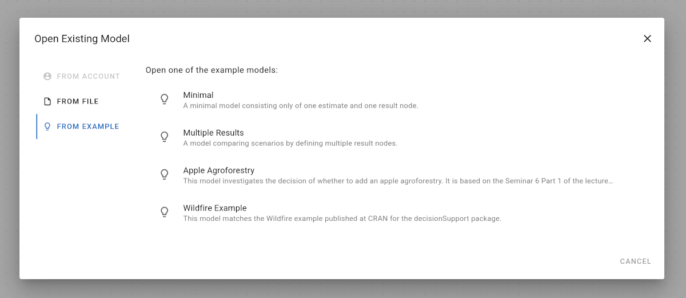
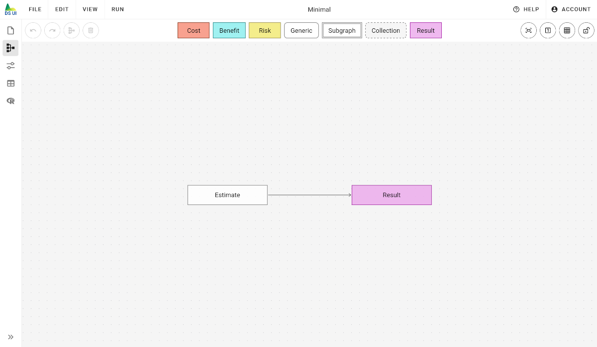
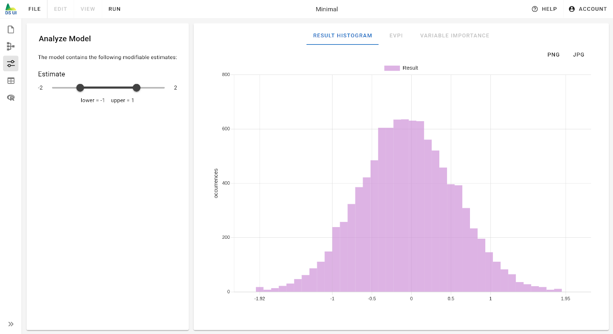
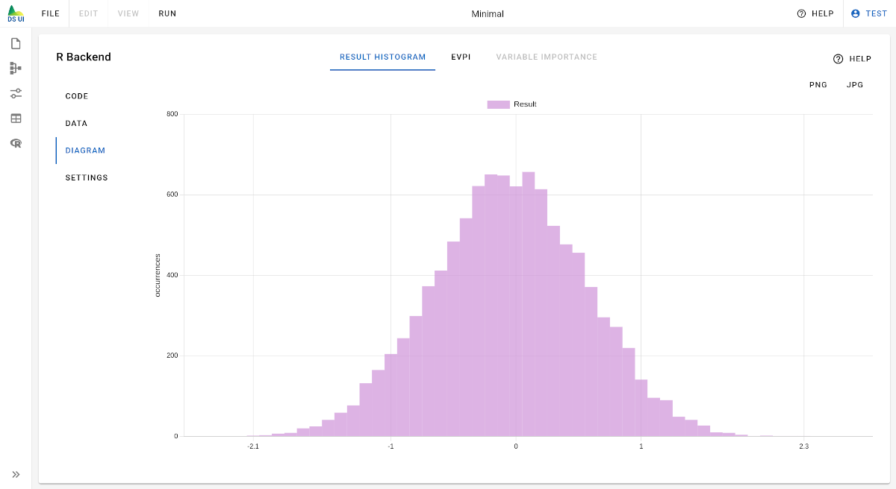

# Getting Started

Welcome to the Decision Support UI! In this section, we will go through every step of this application, starting with:

1. Create an Account and Login
2. Load an Example Model
3. Run a Monte Carlo Simulation
4. Create Your Own Model
5. Save and Load a Model

## Create an Account and Login

To use the full potential of the Decision Support UI, you should create an account. Your account allows you to save, load, and evaluate models with the R backend.

You can create an account by clicking on "[Login or Register](../user-interface/main-menu/login-dialog)" from the account menu in the top right corner:

You need to provide both a username and password.

In case you use the desktop version, all data is stored on your computer. In case you use the Decision Support UI with a browser, the username, password, and your models are stored on the respective server owned by the company or institution that provides the server.

Once you registered an account, you may log in with the same username and password.

## Load an Example Model

You may load models from the [file menu](../user-interface/main-menu) in the top left corner. Of course, in the beginning, you will not have created any models yet. However, you can load an example model by selecting the "[From Examples](../user-interface/main-menu/open-model-dialog)" tab:

Start with the first example model by clicking on the entry "Minimal". Loading a model will open the model editor. Here you can inspect and modify the model:

The model editor is quite complex. There is a separate help page "[Model Editor](../user-interface/model-editor)" in the help section "[User Interface](../user-interface)" that describes every detail.

## Run a Monte Carlo Simulation

The minimal example model consists of a single input variable called "Estimate" and a single output variable called "Result". This simple example does not make sense yet in the context of comparing multiple outcomes of a decision, but can be used to test that you can evaluate a model by running a Monte Carlo simulation.

There are two ways to evaluate a model:

- from the "[Analyze Model](../user-interface/analyze-model)" page
- from the "[R Backend](../user-interface/r-backend)" page

The "[Analyze Model](../user-interface/analyze-model)" page will evaluate your model directly in your browser. Depending on your own hardware, this calculation can be quite fast (with graphics card support) or relatively slow (without graphics card support). Assuming your hardware is able to quickly evaluate your model, the main advantage is that you interactively modify estimate parameters and immediately see how they affect the final result distribution. Navigate to the "[Analyze Model](../user-interface/analyze-model)" page. You should be able to immediately see the result histogram and modify it by dragging the slider for the only estimate:

Alternatively, the "[R Backend](../user-interface/r-backend)" page allows evaluating the model using the R [`decisionSupport`](https://cran.r-project.org/web/packages/decisionSupport/index.html) CRAN package. These calculations happen on the server and require you to create and login into an account. The main advantage is, that you can evaluate your model also on old hardware. Besides, you can inspect the exact R code that is run to evaluate your model. Navigate to the "[R Backend](../user-interface/r-backend)" page, click on the "diagram" tab and start the evaluation by clicking on "calculate diagram". After a few seconds, you should see the exact same result diagram:

## Create Your Own Model

To create your own model, open the "File" menu in the top left corner and select "New" to start with an empty model.

First, you need to add at least one "Estimate" and one "Result" node. You can find detailed information about each node type in the "[Model Editor](../user-interface/model-editor)" documentation. Also, take a look at the examples to get a better understanding of how nodes can be used in common scenarios.

## Save and Load a Model

If you are happy with your model, you can save it by selecting "Save" or "[Save as ...](../user-interface/main-menu/save-model-dialog)" from the "[File](../user-interface/main-menu)" menu in the top left corner. Specify a name for your model and confirm the dialog by clicking on "save as new".

Once you have saved a model, you can access it again later by selecting "[Open...](../user-interface/main-menu/open-model-dialog)" from the "File" menu in the top left corner. It should be listed in the "From Account" tab.
