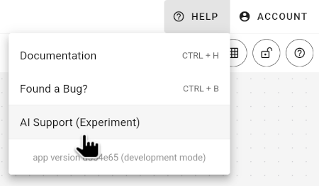
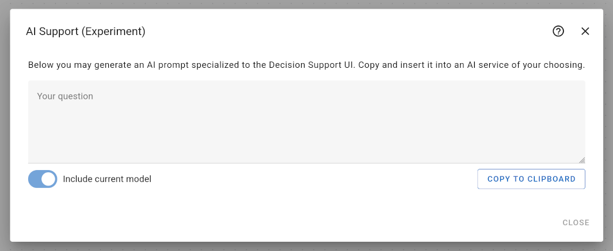

# AI Support (Experiment)

The AI support feature helps you to generate a specialized prompt that can be used with common chatbots like OpenAI ChatGPT or Google Gemini so that you can ask questions about your current model, for example:

- "What does this model do?"
- "How can I extend this model to also include X?"
- "What are typical estimates for cost factor Y?"

You can access the AI support feature from the help menu in the top right corner.

Clicking the menu entry will open the following dialog.

In this dialog, you may enter any question or task. Unfortunately, there is no direct integration with common chatbots like OpenAI ChatGPT or Google Gemini. So, you cannot simply submit your questions from this dialog. Instead, you have to copy and paste the generated prompt manually.

1. Enter a question or task
2. Decide whether to include information about the current model
3. Click on "Copy to Clipboard"
4. Open your favorite chatbot in another browser window
5. Paste the specialized prompt into the input box of your favorite chatbot (e.g. via `CTRL + V` or via a right click and selecting "Paste")

> Please keep in mind that the chatbot's answer is not based on an actual thought process and is likely to contain incorrect statements masked as facts. Always double check any information provided by a chatbot when developing scientifically sound decision models.

## How does this prompt work?

The generated prompt consists of detailed information that helps a chatbot to get a basic impression of the Decision Support UI tool and the context of your question. In essence, it is a simple text template that is filled with information from your model. You can copy the prompt to a simple text editor and simply read it.

The following information is included in the prompt:

- a concise description of the Decision Support UI tool
- a technical description of the formula syntax
- a generated description of each node in your model (in case the option is enabled)
- a description of how the chatbot is supposed to answer your question
- your query

You can adapt this prompt to your liking. In case you discover a better prompt, please let us know by opening a GitHub ticket.
