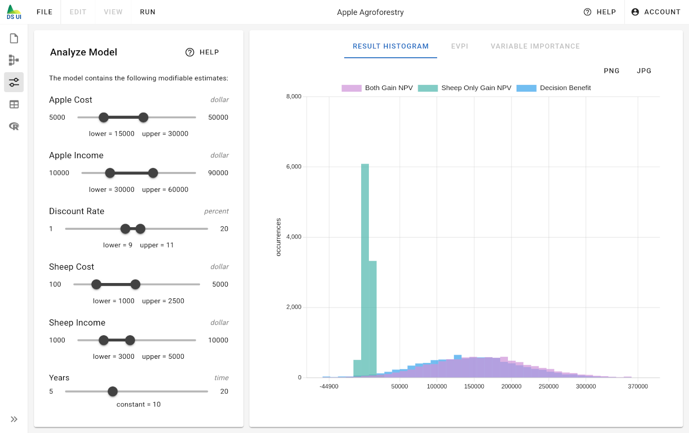

# Analyze Model

The Analyze Model page shows the results of the Monte Carlo simulation for your model. In contrast to the [R Backend](../r-backend) page, results are calculated directly in your browser. An important advantage is that results can be calculated immediately without delay. Changing model parameters will be immediately reflected in the simulation results, and thus, allows to analyze the impact of model parameters onto the final output distribution.

The analyze model page consists of two parts:

- Left: A list of estimate nodes whose parameters can be interactively changed
- Right: A visualization of the result histogram

## Estimate List

The estimate list shows all estimate nodes that are allowed to be modified sorted by their name. You can adjust whether and how estimate parameters can be modified in the [Analyze Tab](../model-editor/node-edit-dialog/analyze-tab) of the [Node Edit Dialog](../model-editor/node-edit-dialog) for the respective estimate node.

Estimates that define probabilistic variables can be modified by adjusting the lower and upper bound of their confidence interval between certain minimum and maximum values as defined in the [Analyze Tab](../model-editor/node-edit-dialog/analyze-tab).

Estimates that define deterministic variables can be modified by adjusting the constant value between a minimum and maximul value as defined in the [Analyze Tab](../model-editor/node-edit-dialog/analyze-tab).

As soon as an estimate is changed, the Monte Carlo simulation is started again and the result histogram is updated with new results.

## Result Histogram

The result diagram shows the output distribution of all result nodes. For each result node, one histogram is added to the result diagram. By comparing two or more histograms with each other, you can draw conclusions about the decision benefit.

You can influence how the result diagram is generated from the "Run" menu of the [Main Menu](../main-menu). There you can choose the number of histogram bins and the number of Monte Carlo runs.

A low number of bins will lead to coarse histograms. A large number of bins will lead to detailed histograms.

Depending on the number of histogram bins, you need to choose an appropriate number of Monte Carlo runs. A low number of Monte Carlo runs might not be sufficient to accurately reflect the output distribution. If you observe strong variations in the result diagram when re-evaluating the model (with the rocket button), you should use more Monte Carlo runs. If the histograms appear to be the same when lowering the number of Monte Carlo runs, you can safely reduce it.

Once you are happy with the result diagram, you can download it as a PNG or JPEG image file by clicking on the respective download buttons.
