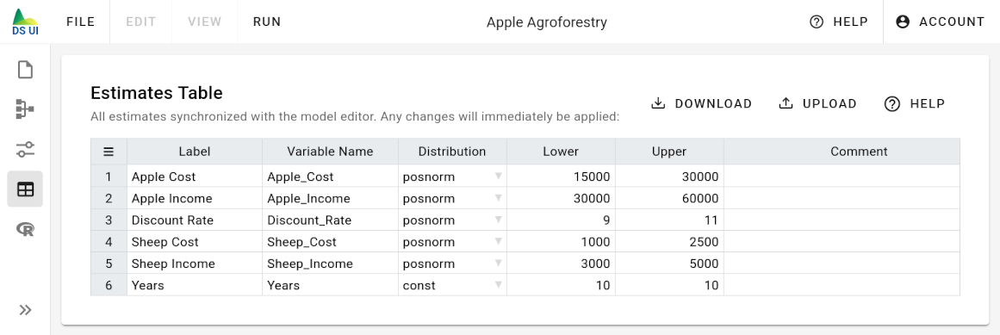

# Estimates Table

The estimate table provides an overview over all estimate nodes of your model. For each estimate node, there is a corresponding row in the estimate table. All properties of the node (e.g. its label or its distribution type) are synchronized with the nodes in the model editor.

You may change the parameter of an estimate by double-clicking on the corresponding cell in the estimate table. Any changes will be immediately reflected in the [Model Editor](../model-editor) and [Analyze Model](../analyze-model) page.

The table contains the following columns:

- `Label` \
  the node title that is show as a label in the work space of the model editor
- `Variable Name` \
  The variable name that is used for this node both in other formula expressions and in the generated R code.
- `Distribution` \
  The distribution type of the estimate. It can be either `const` (deterministic estimate), `norm` (normal distribution),
  `posnorm` (one-sided truncated normal distribution with positive values only), `t_norm_0_1` (two-sided truncated normal distribution between with values between 0 and 1)
- `Lower` \
  Lower bound of the 90% confidence interval, i.e., the 5%-[quantile](https://en.wikipedia.org/wiki/Quantile)
  of the distribution
- `Upper` \
  Upper bound of the 90% confidence interval, i.e., the 95%-[quantile](https://en.wikipedia.org/wiki/Quantile)
  of the distribution
- `Comment` \
  A comment that describes the estimate in more detail.

## Download and Upload Estimates as CSV

In case you would like to save and compare multiple variations of estimate parameter settings, you can download the
estimate table as a CSV file by clicking on the download button.

The CSV file contains an additional column `node` that is used to match a CSV row to the node of
your model. Please do not modify this identifier for a node. Otherwise, you will not be able to correctly load
the CSV file.

Except for the `node` column, you may change any other columns in the CSV file.

To apply your changes, you can load the modified CSV file by clicking on the upload button.
