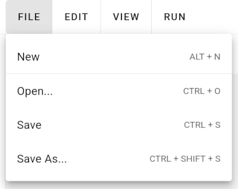

# Main Menu

The main menu allows accessing common functionalities from any page of the Decision Support UI:


From left to right, the main menu consists of the following sub menus:

- "File" - the menu to load and save a model
- "Edit" - the menu to select, copy, and paste individual nodes
- "View" - the menu to adjust how the model is visualized
- "Run" - the menu to specify parameters how the model is evaluated
- "New Model" - the name of the current model (which can be specified on the "Metadata" page)
- "Help" - the menu to access this help documentation
- "Account" - the menu to login and logout of your account

## Keyboard Shortcuts

If there is a keyboard shortcut defined for a specific function, it is shown to the right of a menu entry:



In case of the file menu, you may discard the current model and start with a fresh model by either clicking the corresponding menu entry `New` or by hitting the keyboard combination `ALT + N`.

On MacOS, you can use the `⌘ Command` key instead of the `CTRL` key.

## File Menu

The file menu provides the following functions:

- "New" - discard your current model and start with a fresh empty model
- "Open..." - open the "[Open Model](./open-model-dialog)" dialog which can be used to open an existing model
- "Save" - save the current model to your account unless it was never saved before, which opens the "Save Model" dialog
- "Save As..." - open the "[Save Model](./save-model-dialog)" dialog which allows saving the model to your account or as a file

## Edit Menu

The edit menu provides the following functions:

### Undo & Redo

The Undo and Redo feature allows reverting and reapplying recent changes to your model. However, only substantial changes to your model can be reverted. Simple visual changes, e.g. changing the current zoom level, cannot be undone. A maximum of 50 recent changes can be undone and reapplied.

- "Undo" - undo any modification to your current model
- "Redo" - reapply changes that you have previously undone by using the "undo" function

### Node Selection

- "Select All Nodes" - select all nodes currently visible in the editor
- "Unselect All" - deselect all nodes such that nothing is selected
- "Select Multiple" - hint that you may use `CTRL + Click` to select multiple nodes
- "Box Selection" - hint that you may use `SHIFT + Click` and drag to select multiple nodes via a box selection

### Subgraph

- "Create Subgraph from Selection" - move all currently selected nodes into a new subgraph node

### Copy & Paste

The copy & paste features allows copying a selection of nodes to your clipboard. You may select any number of nodes or subgraphs and copy them by pressing `CTRL + C`. Selected nodes and all their properties are translated into a machine-readable text file (in JSON format) and copied to your clipboard. You can then paste these nodes to the same model, a different subgraph or a different model in a separate browser window or browser tab by pressing `CTRL + V`. You may also save your nodes in a simple text file by opening a text editor and pasting the text to this text file. The pasted text should look like this:

```
{
  "_schema": {
    "name": "de.uni-bonn.decision-model/graph",
    "version": 1
  },
  "graph": {
    "nodes": [
      {
        "id": "5",
        "type": "variable",
        "nodeParentId": null,
        "subgraphParentId": null,
        "function": {
          "type": "operation",
          "variable": "Generic_5",
          "expression": ""
        },
        "visualization": {
          "title": "Generic 5",
          "position": {
            "x": 350,
            "y": -45
          },
          "size": {
            "width": 200,
            "height": 50
          },
          "style": {
            "type": "generic"
          },
          "autoConnect": true
        }
      }
    ],
    "edges": []
  }
}
```

You may later paste these copied nodes by copying the full text from your text editor (via `CTRL + C`) and pasting the text into your model by clicking inside the model editor and pressing `CTRL + V`.

> Warning: Please note that copying and pasting the same node inside the same model (meaning duplicating a node) does not resolve duplicate variable names. If there are two or more nodes defining the same variable, references to this variable will be ambiguous and might cause issues when evaluating the model. Please make sure that every node has a unique variable name.

- "Cut" - copy the selected nodes to your clipboard and remove the selected nodes from the current model
- "Copy" - copy the selected nodes to your clipboard
- "Paste" - paste previously copied nodes to the current model

### Remove Nodes

- "Remove" - deletes any selected nodes from your model

## View Menu

The file menu provides the following functions:

- "Zoom In" - increase zoom level of the editor
- "Zoom out" - decrease zoom level of the editor
- "Zoom to Fit" - change the zoom level such that all visible nodes fit into view
- "Reset Zoom" - set zoom level to its default value
- "Lock Graph" / "Unlock Graph" - disallow and allow modifying the model
- "Enable Free Movement" / "Enable Snap-to-Grid" - disable and enable the snap-to-grid function
- "Change Edge Style" - toggle between different edge visualization styles
- "Change Background" - toggle between different background styles
- "Disable Auto-Connect Nodes" / "Enable Auto-Connect Nodes" - disable and enable automatically adding edges between nodes that are computational dependencies (meaning, a node references another node's variable)

## Run Menu

The run menu provides the following frontend functions:

- "Monte Carlo Runs" - Choose the number of Monte Carlo runs that are calculated to estimate probabilistic variables

- "Histogram Bins" - Choose the number of histogram bins that is used to preview the distribution of probabilistic variables

- "Use GPU acceleration" - If enabled, calculations in the browser are accelerated with your GPU if possible

- "Recalculate Frontend" - Reset all calculations and compute model again from scratch

> Warning: Increasing the frontend Monte Carlo runs setting might make your browser unresponsive. Try to decrease
> this setting in case your browser is lagging, meaning, your browser does not immediately react to mouse clicks or
> other interactions.

Besides, the run menu provides the following R backend functions, which are only available for logged-in users:

- "Calculate Result Histogram" - Trigger the calculation of the result histogram via the R backend

- "Calculate EVPI" - Trigger the calculation of the EVPI via the R backend

## Help Menu

The help menu allows accessing this documentation.

## Account Menu

The account menu can be used to log in into your account or create a new account via the [Login Dialog](./login-dialog). If logged in, the account menu is replaced with your username and can be used to log out of your account.
