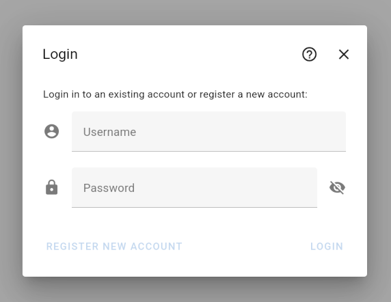

# Login Dialog

You may create an account and log in to this account from the login dialog that can be opened from the "Account" menu in the top right corner:

## Create An Account

In order to create an account, type in a unique username and password, and confirm the registration by clicking on "Register New Account".

Usernames need to consist of at least 3 characters. Passwords need to consist of at least 8 characters.

> Warning: There is currently no way to recover a lost password or change your password. Please choose your username and password wisely.

## Stored Information

The Decision Support UI only stores information that you specifically provide to it, meaning:

- Username
- Password
- Models saved to your account

Apart from this, no additional information about you, or how you interact with the Decision Support UI, is stored.

> Warning: Given that account features are very basic, please make sure not to store any personal information inside this account.

## Log In to Your Account

Simply type in your username and password, and confirm with clicking on "Login".
