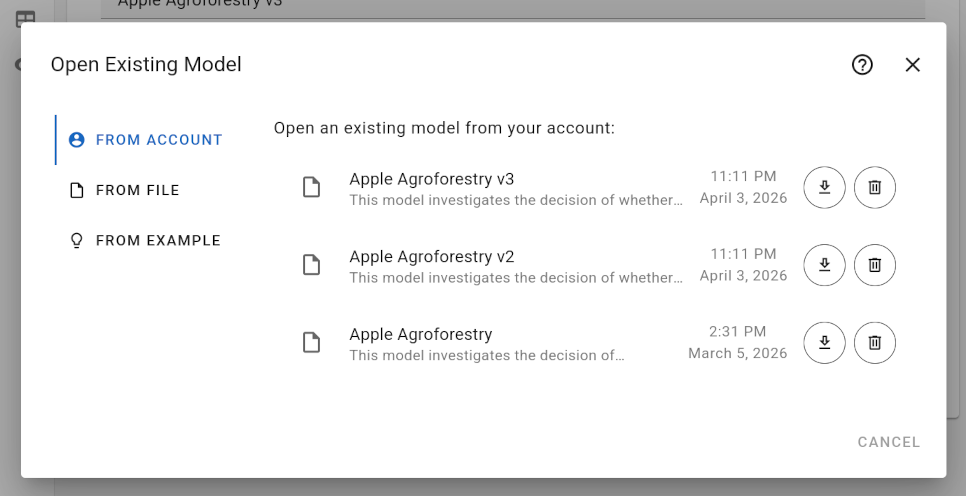

# Open Model Dialog

In order to open an existing model, you can click on the "Open..." entry of the "File" menu, see [Main Menu](../). Then, the following dialog is displayed:

You may load an existing model from your account (if you are logged in), a previously saved file, by opening an example model.

## From Account

In order to load a model from your account, you first need to login by clicking on the "Account" menu in the top right corner and entering your username and password in the [Login Dialog](../login-dialog).

If logged in, you previously saved models should be listed. The most recently saved model is shown at the top.

You can load a model from your account by clicking on the model name in the list of available models.

Besides, there are two buttons to the right of each model name:

- "Download as File" - download a model from your account as a file
- "Tash" - remove a model from your account

In order to remove a model from your account, click the on the "Trash" button and confirm your choice by clicking the red check mark.

You may save at most 100 models to your account.

## From File

In order to load a model from an existing file, switch to the "From File" tab, click on the "Upload a File" button and select the previously saved model file.

## From Example

In order to load an example model, switch to the "From Example" tab and click on the name of one of the example models.
