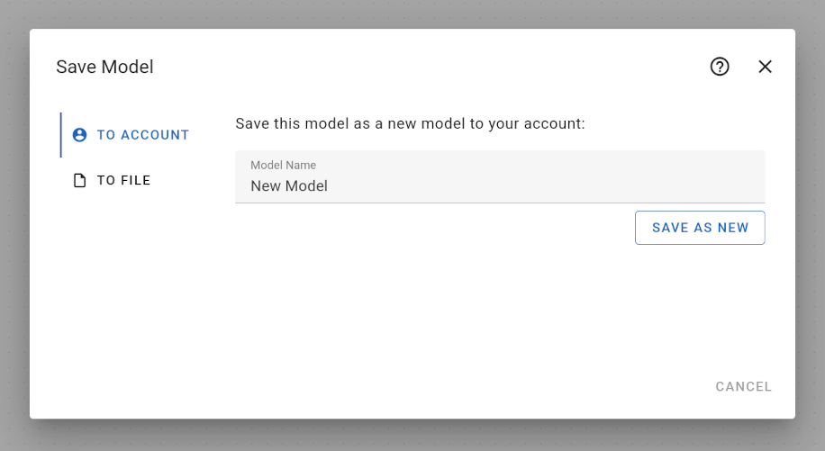

# Save Model Dialog

To save your model, you can open the "Save Model" dialog from the "File menu" by clicking on "Save As...", see [Main Menu](../). Then, the following dialog opens:

There are two ways to save your model: to your account in case your are logged in, and to a file.

When saving your model to your account, you can change the name of your model again directly in the dialog. The name is the same name defined in the "[Metadata](../../metadata)" page. This name is also the name that is shown for your model in the [Open Model Dialog](../open-model-dialog).

You can use the same name for two or more different models. Models with the same name are not overwritten, but are stored as separate models.

You cannot overwrite a previously saved model from the "Save Model" dialog. In order to overwrite an existing model, you need to open it first, modify it, and then save it by clicking on the "Save" menu entry from the "File" menu.

You may save up to 100 different models in your account.
