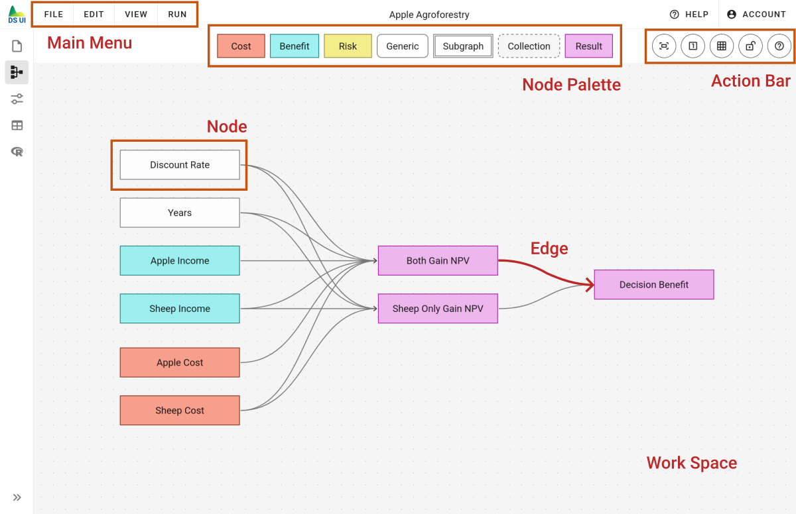
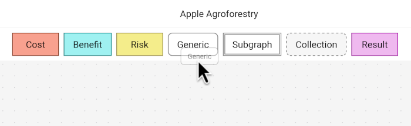
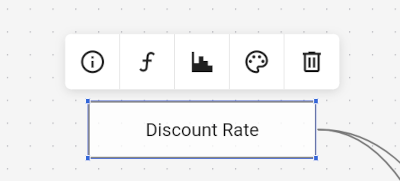
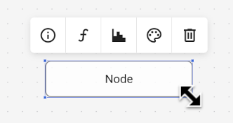
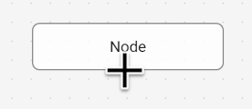
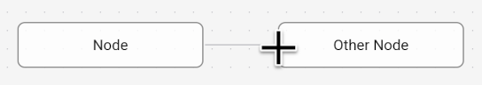

# Model Editor

The model editor allows building a mathematical representation of a decision and its outcomes. It uses interconnected boxes called _nodes_ to design a mathematical function as a computational network called a _graph_. Because of that, users do not need to be familiar with writing R code. However, eventually, the model graph is converted to [R code](../r-backend), which is then used to run a Monte Carlo simulation to evaluate all outcomes of a decision-making process.

The model editor is divided into multiple parts:

- [Main Menu](../main-menu) - various functions to load, save and edit the model
- Node Palette - shows all available node types
- Work Space - contains the nodes that define the decision model
- Action bar - quick access to common functions like undo and redo

The following screenshot highlights each part of the model editor:

## Work Space

The work space shows all nodes of the current model, except for nodes that are hidden inside a subgraph node.

Inside the work space, you may:

- move the view pane around by clicking and dragging with the left mouse button
- zoom in and out with the scroll wheel of your mouse
- select a node with a left mouse click
- open detail information about a node by double-clicking it
- move a node around by holding the left mouse button
- select multiple nodes by holding the `CTRL` key and clicking each node individually
- select multiple nodes by holding the `SHIFT` key and drawing a box around the nodes
- remove a node or edge by selecting it and pressing the `BACKSPACE` key

## Node Palette

The node palette contains a list of pre-defined node templates that can be used to build a model. Fundamentally, there are 3 different node types:

- "[Variable](./node-edit-dialog/function-tab)" nodes - that calculate something
- "[Subgraph](./subgraphs)" nodes - that hide other nodes inside a subgraph
- "Collection" nodes - that group other nodes without hiding them

You cannot change the basic type of a node after the node was added to the model, e.g. change a variable node into a subgraph node, or a subgraph node into a variable node.

In addition, variable nodes may have different function types:

- "[Estimate](./node-edit-dialog/function-tab)" nodes - that define input parameters of the model
- "[Operation](./node-edit-dialog/function-tab)" nodes - that calculate a mathematical formula based on other nodes
- "[Result](./node-edit-dialog/function-tab)" nodes - that are treated as the final output variable of a model

You can change the function type of a variable node in the [Node Edit Dialog](../node-edit-dialog), which can be open from the node toolbar (see below), or by double-clicking a node.

By default, different nodes have different styles:

- [Estimate](./node-edit-dialog/function-tab) and [Result](./node-edit-dialog/function-tab) nodes are drawn with a border with sharp corners
- [Operation](./node-edit-dialog/function-tab) nodes are drawn with rounded corners
- [Subgraph](./subgraphs) nodes are drawn with two borders
- Collection nodes are drawn with a dashed border

Besides, there are 4 different color templates:

- Nodes that represent costs are drawn with a red background
- Nodes that represent benefits are drawn with a cyan background
- Nodes that represent risks are drawn with a yellow background
- Result nodes are drawn with a purple background

However, these styles can be changed in the [Style Tab](./node-edit-dialog/style-tab) of the [Node Edit Dialog](./node-edit-dialog).

## Adding Nodes

You can insert a node into the work space by clicking, holding and dragging a box from the node palette to the work space area.

## Node Toolbar

When exactly one node is selected, a toolbar is shown for this node:

The toolbar allows accessing additional details about the node by opening a separate dialog. From left to right, the toolbar icons correspond to:

- General information about the node, its name and description
- Function definition of a variable node, its mathematical formula
- Data visualization of a node, showing a diagram
- Style settings of a node, allowing to edit a node's background color and border style
- Removing the node

More details about each function can be found in the help section of the [Node Edit Dialog](./node-edit-dialog).

## Resizing Nodes

You may change the dimensions of a node by selecting it, and then dragging one of the four blue dots in the corners of a node:

## Adding Edges

There are two types of edges:

- manually drawn edges between nodes (dashed lines)
- automatically deduced edges between nodes (solid lines)

You can manually draw edges between nodes by hovering over specific sections on the border of a node. Hovering over
these special sections will cause the mouse cursor to change into a cross or plus sign:

Then, you can click and drag your mouse towards another node, which will create the edge:

You can remove a manual edge by selecting it with a left mouse click and confirming the removal by pressing the `BACKSPACE` key.

## Automatic Edges between Nodes

Usually, you do not need to manually draw edges between nodes. Edges are automatically inferred based on whether one node references another node in its function definition. In rare circumstances, it might be useful to manually draw an edge between two nodes, e.g., to highlight a conceptual dependency, even if there is no actual computational dependency present between these nodes.

If both a manual edge and automatic edge is available, drawing the automatic edge is prioritized. However, the manual edge is still remembered. If the function definition of those nodes changes, the automatic edge might disappear and the manual edge might be shown instead.

You can disable automatic edges for all nodes from the "View" menu. You may disable automatic edges for one specific node from the "General" tab in its [Node Edit Dialog](./node-edit-dialog).

## Action Bars

There are two action bars to the left and right of the node palette. These buttons provide quick access to common functions that are also available from the "Edit" and "View" menu, see [Main Menu](../main-menu).

From left to right, the left action bar provides the following functions:

- "Undo" - reverts your most recent change to the current model
- "Redo" - reapplies changes that were previously undone by using the "undo" function
- "Create Subgraph from Selection" - creates a new subgraph node and moves all selected nodes inside this subgraph
- "Remove" - removes selected nodes or edges

From left to right, the right action bar provides the following functions:

- "Zoom to Fit" - change the zoom level such that all visible nodes fit into view
- "Enable/Disable Snap-to-Grid" - disable and enable the snap-to-grid function
- "Lock Graph" - disallow and allow modifying the model
- "Help" - opens this help document
