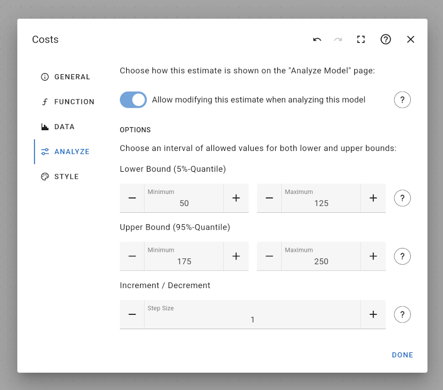

# Analyze Tab of the Node Edit Dialog

The "analyze" tab is only available for estimate nodes and allows restricting how parameters of the estimate can be interactively changed on the [Analyze Model](../../../analyze-model) page.

First, you can choose whether an estimate is actually shown on the [Analyze Model](../../../analyze-model) page. This might be useful in case an estimate was deduced from scientific research and is somewhat known and fixed. In contrast, other estimates might be rough estimates whose boundaries are only broadly known. In this case, you might want to experiment with these parameters on the [Analyze Model](../../../analyze-model) page in order to figure out its influence on the overall model result.

In order to restrict the range of how estimate parameters can be interactively changed on the [Analyze Model](../../../analyze-model) page, you can define minimum and maximum values for both the lower and upper bound parameters. This can be useful if an estimate follows a probability distribution whose confidence boundaries cannot be chosen arbitrarily, e.g. a positive truncated normal distribution. Specifying appropriate minimum and maximum values for both lower and upper bound makes sure that it is not possible to choose parameters that are uncalculable.

Finally, you can define a step size, which influences the granularity of value changes when interactively selecting estimate parameters on the [Analyze Model](../../../analyze-model) page. This can be useful when working with very large or very small values, e.g. costs measured in thousands of dollars.
