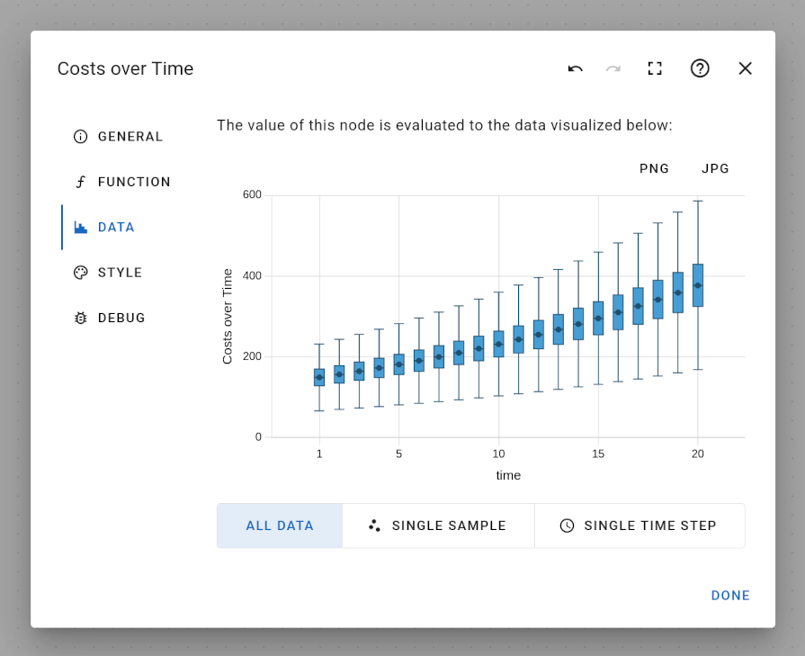

# Data Tab of the Node Edit Dialog

The data tab visualizes the calculated value for this node. Depending on the kind of value, different visualizations are used:

- a simple deterministic value is indicated as simple number, e.g. `123`
- a probabilistic value is visualized in a histogram
- a series of deterministic values is shown as a simple scatter plot
- a series of probabilistic values is visualized with a box plot

For probabilistic values, you can influence the precision of their visualization from the "Run" menu, see section [Main Menu](../../../main-menu):

- "Monte Carlo Runs" - determines the number of random samples that are drawn to estimate a probabilistic value
- "Histogram Bins" - determines the number of bins that are calculated for this histogram visualization

Choosing higher values for both "Monte Carlo Runs" and "Histogram Bins" will lead to a more detailed visualization of probabilistic values, but may take more processing time.

Visualizations are only recalculated if the node's function definition was changed or any dependent variable was changed. That means, if all estimate nodes in your model remain unchanged, the exact same random sample is used to calculate all data and visualizations. You can manually request a new random sample by clicking on "Recalculate Frontend" from the "Run" menu, see section [Main Menu](../../../main-menu).

### Visualization of Probabilistic Variables with Time-Dependency

Variables that describe a series of values are visualized as a box plot.

In addition, there are three visualization options that help to get a better understanding of the data:

- "All Data" shows all values in a single visualization as a box plot (default option)
- "Single Sample" reduces the data to a single random sample and visualizes this sample in a scatter plot
- "Single Time Step" allows selecting a specific time slice and visualizes that data in a histogram

For example, when modelling events that either occur or not occur as values 0 (event does not occur) or 1 (event does occur) within a time series, it can be helpful to inspect a single sample of the probabilistic time series in order to see the exact occurrences of events for that sample. Since the random sample of your model remains the same unless an estimate node is changed, with this visualization, you can track and verify how an event influences other variables through the time series.
