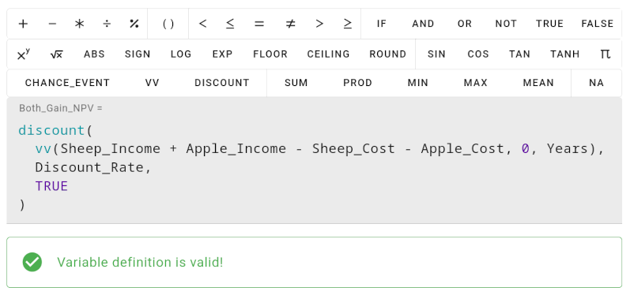
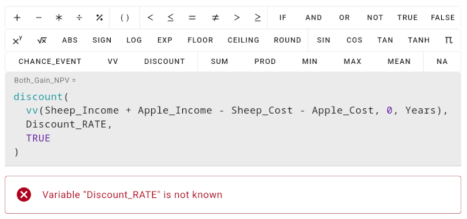
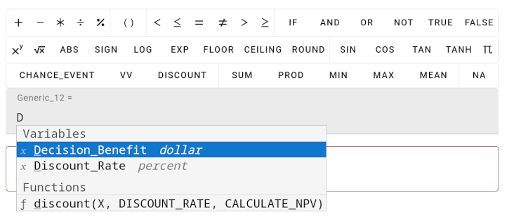

# Formula Expression Input

Formula expressions determine the value of a variable and follow usual mathematical conventions, meaning standard mathematical operators and functions can be used. Formula expressions also follow the traditional order of [operator precedence](https://en.wikipedia.org/wiki/Order_of_operations), meaning, multiplication is applied before addition, unless there are parentheses that overrides this order.

When defining a formula expression, first, click inside the input field. This will show a toolbar of buttons of all available functions:



Below a formula expression, a success or error message is shown, depending on whether problems with the formula expression or calculation was found.

## Mathematical Operators and Functions

You can use various mathematical functions as well as central functions from the [decisionSupport](https://cran.r-project.org/web/packages/decisionSupport/index.html) CRAN package like `chance_event`, `vv` and `discount`. The following features are supported:

- mathematical operators, e.g. addition, subtraction, multiplication, division, modulo
- parentheses to change operator precedence
- logical comparisons, e.g., lower than, lower than or equal, equal, unequal, etc.
- a simple if-else-statement, see below
- logical combinations, e.g., and, or, not
- basic mathematical functions, e.g., power of, square root, sign, logarithm, exponential function, floor, ceiling and round
- trigonometry functions, e.g., sine, cosine, tangent, hyperbolic tangent
- series functions, e.g., the sum, min, max or mean over a series
- various constant values, e.g. pi, true, false, not-available
- decisionSupport functions, e.g., `chance_event`, `vv` (value varier), `discount`, see below

## Variables

Variable names are resolved in a case-sensitive way, meaning the variable `Discount_Rate` and `Discount_RATE` are considered two different variables.

If a variable is not known in your model, an error message is shown below the formula expression:



All nodes and variables are available in all formula expressions anywhere in your model, even in subgraphs.

> Warning: There can be no circular dependencies between variables. When defining a variable, you cannot reference the variable itself inside its formula expression. This extends to other variables as well, e.g., when defining variable `A` using `B`, variable `B` cannot depend on variable `A`.

## Auto-Complete

Variables, functions and constants are suggested to you while typing a formula expression:



You can also ask for suggestions by pressing `CTRL + SPACE`.

## If Statement

The if statement allows to define alternatives given a condition. For example, you can distinguish two different estimates based on the value of another variable:

```
if ( Risk > 0.5 ) High_Costs else Low_Costs
```

When clicking on the `IF` toolbar button, a separate dialog opens that helps you to define an expression for the if condition and both alternatives.

The condition of an if statement needs to evaluate to something true or false, e.g., by applying a comparison between two values, but can also be a variable.

Both alternatives may be deterministic values, probabilistic values or a series of values. However, when one of the alternatives is probabilistic, the result will always be probabilistic, independent of the actual condition. Also, when one of the alternatives is a series, the result will always be a series. If multiple series are used, they all need to have the same length (e.g. time steps).

To get a better understanding of the underlying calculation, the if statement is just a different way to specify the following mathematical formula:

```
(CONDITION * VALUE_IF) + (1 - CONDITION * VALUE_IF_NOT)
```

This means, all values are always calculated, independent of the actual condition.

## Decision Support Functions

You can use the following functions from the [decisionSupport](https://cran.r-project.org/web/packages/decisionSupport/index.html) CRAN package. All parameters and options are implemented analogous to the decisionSupport R package. A detailed documentation of all options can be found inside the [reference manual](https://cran.r-project.org/web/packages/decisionSupport/refman/decisionSupport.html):

- [`chance_event`](https://cran.r-project.org/web/packages/decisionSupport/refman/decisionSupport.html#chance_event) - simulate occurrence of random events
- [`vv`](https://cran.r-project.org/web/packages/decisionSupport/refman/decisionSupport.html#vv) - value varier function
- [`discount`](https://cran.r-project.org/web/packages/decisionSupport/refman/decisionSupport.html#discount) - Discount time series for Net Present Value (NPV) calculation
