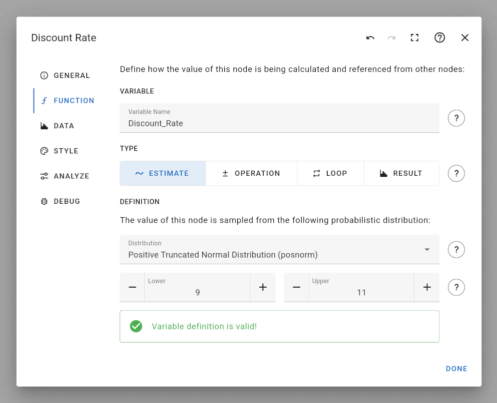
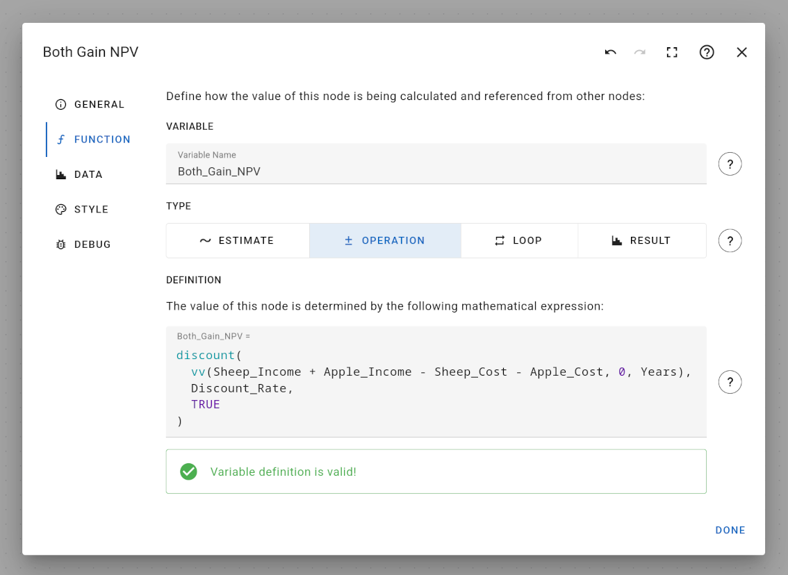
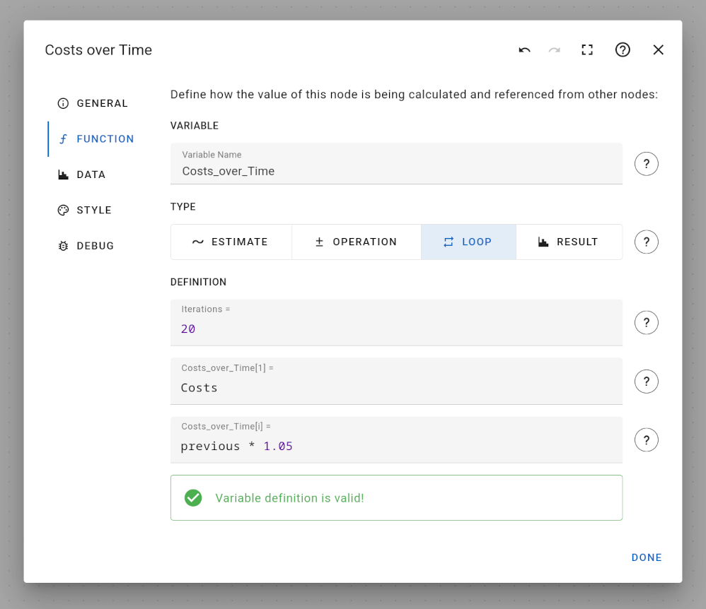

# Function Tab of the Node Edit Dialog

The function tab is only available for variable nodes and allows specifying how a node is calculated.

Each variable node needs to have a variable name, which can be used to refer to this node's value from other variable nodes. Variable names need to be compatible with R code, so you cannot use spaces and other special symbols inside variable names, only regular letters and the underscore is allowed.

## Unit of Measurement

You may specify a unit of measurement for a node's variable. Typical examples are `m` (meter), `kg` (kilogram) or `dollar`. You don't have to use standard units, though. You can specify any name, e.g., `weight`, `currency`, `points` or even `something`.

A node's unit of measurement does not affect the model calculation in any way. It is only used as a hint. For example, a warning message is shown in case you try to combine variables of different units of measurement in a formula expression. In this case, you need to manually check whether this will cause any issues in your calculations and make sure that variables are correctly converted between different units if necessary.

In order to help users building correct decision models, units of measurements are displayed in various other parts of the user interface, e.g., when getting auto-complete suggestions while [editing formulas](../formula-expression-input/), in the [Estimates Table](../../../estimates-table/), and in the corresponding [R Code](../../../r-backend/).

## Function Type

There are currently 4 different ways to specify the function definition of a variable node:

- "Estimate" type - consider a variable as an input parameter and choose a fixed value or probability distribution
- "Operation" type - define a mathematical formula that determines the value of this variable
- "Loop Operation" type - use a simple loop definition to calculate the value of this variable, e.g. when simulating multiple years
- "Result" type - consider this node's value to be the output of this model

### Estimate Type

An estimate node allows adding an input variable to your model. It may either be a deterministic estimate, meaning a constant value, or a probabilistic estimate, meaning an input that follows a random process. In the latter case, you need to choose one of the supported probability distributions that best describes your input variable:

- Normal Distribution
- Positive Truncated Normal Distribution
- 0-1 Truncated Normal Distribution

Instead of specifying probability distributions by declaring their respective parameters (e.g. mean and variance of a normal distribution), probability distributions are inferred from boundaries of a confidence interval:

- the lower bound of the 90% confidence interval, i.e., the 5%-quantile of the distribution
- the upper bound of the 90% confidence interval, i.e., the 95%-quantile of the distribution

Based on these confidence bounds, distribution parameters (like mean and variance) are automatically inferred.

Unfortunately, it is not always possible to find matching distribution parameters for arbitrary confidence bounds. For example, confidence bounds for the 0-1 truncated normal distribution also have to lie between 0 and 1. Confidence bounds outside this interval are naturally invalid, since the 0-1 truncated normal distribution only allows values between 0 and 1. In case confidence bounds are invalid, an appropriate error message is shown.

If data can be generated from your estimate definition, a green success message is shown.

### Operation Type

An operation node defines an intermediary variable that calculates a combination or transformation of other variables. For example, given two estimates nodes that describe a cost and benefit, an operation node could subtract the costs from benefits to come up with the total gain. In order to specify this relationship between variables, a mathematical formula expression needs to be defined:

The mathematical formula expression can be arbitrarily complex and use various mathematical functions. A detailed description is given in section [Formula Expression Input](../formula-expression-input).

### Loop Operation Type

A loop operation type extends the idea of an operation node to calculate a list of values. The meaning of the list of values is not predetermined, but usually describes a time-dependency. In order to specify the value change, three formula expressions need to be defined:

- the total number time steps
- the initial value of the variable at time step 1
- the values of the variable at time step 2,3,4 ...

For example, costs may grow over a 20-year time period by a certain factor describing the inflation rate:

- the total number of time steps is: `20`
- the initial value matches the estimate variable for costs: `Costs`
- the iteration expression describes a 5-percent growth of the variable: `previous * 1.05`

In contrast to regular operation nodes, there are two special features that you can use when defining formula expressions for loop nodes:

- You may refer to the current time step with the term `i` (meaning 1,2,3 ...)
- You may refer to the previous value of your current variable with the term `previous`
- You may refer to the value of other variables at the same time step by appending `[i]` or `[i-1]`, e.g. `Benefits_over_Time[i]`

You may only reference other variables if they have the exact same number of time steps. Also, you cannot currently reference a specific time step, e.g. `Benefit_over_Time[20]`.

Besides that, mathematical formula expression can be arbitrarily complex and use various mathematical functions. A detailed description is given in section [Formula Expression Input](../formula-expression-input).

### Result Type

A result node works exactly like an operation node. The only difference is that result nodes are considered output variables of your model. Because of that, their values are visualized in the final result histogram on the [Analyze Model](../../../analyze-model) page.
