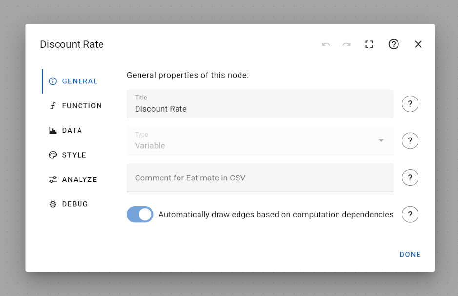

# General Tab of the Node Edit Dialog

The general tab allows entering a title and comment for a node. The title corresponds to the text that is shown as a label for a node in the work space.

### Node Title and Variable Name

Variable nodes are referenced by a variable whose name can be specified in the "Function" tab, see below. For your convenience, if both the title and variable name matches, changing the title of a node also changes the variable name for this node.

For example, if the title of the node is `Discount Rate` and the variable name for this node is `Discount_Rate` (spaces are replaced with underscores), both node title and variable name are considered the same. Changing the title to `Discount Rate in Percent` will automatically change the variable name to `Discount_Rate_in_Percent`.

Unfortunately, changing a variable name does not automatically update all formulas to use this new variable name. You have to update all references to this variable manually.

Variable names are not changed automatically if they do not match the node title. For example, if the title of the node is `Discount Rate` and the variable name for this node is `Disc_Rate`, changing the title does not have any effect on the variable name, unless you change the node title to `Disc Rate` such that both match again.

### Automatically Drawn Edges

When variables are referenced inside the function definition of a node, an edge between these two nodes is automatically drawn, representing the computational dependency between the two nodes. You may exclude the current node from this automatic procedure by disabling the corresponding option.

Excluding a node can be beneficial in case a node describes a context variable that is used in many other node calculations, e.g. the number of years that are simulated in your model. In this case, excluding a node might reduce the total number of edges and improve the overall readability of the model graph.
