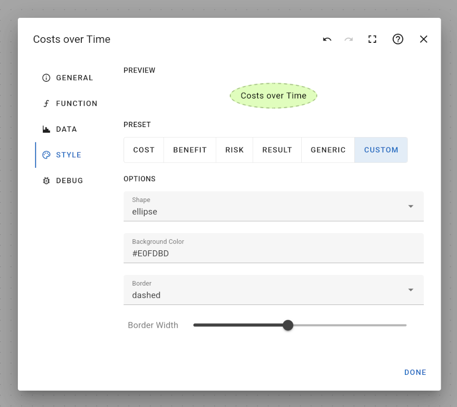

# Style Tab of the Node Edit Dialog

The style tab allows changing how a node is visualized in the work space. You can choose from 5 different style presets:

- Cost
- Benefit
- Risk
- Result
- Generic

Besides, you may choose a custom style for your node by selecting the "Custom" option:

You can customize your node with the following options:

- Shape: box, rounded box, ellipse
- Background Color: click to select any color and opacity
- Border: solid line, dashed line, dotted line
- Border Width: thin or thick border
