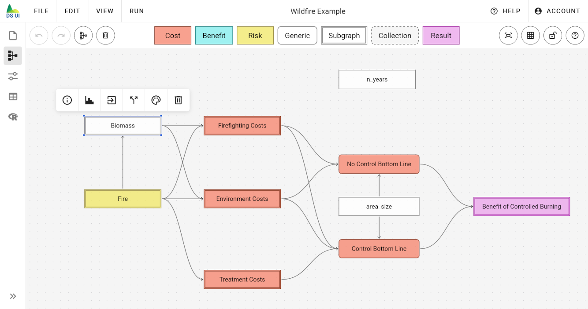
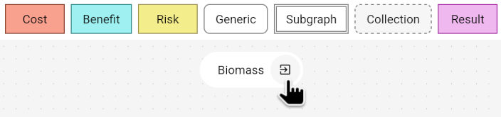

# Subgraphs

Subgraphs are sets of nodes that are hidden from the main graph. You can use subgraphs to hide complexity, increase readability or combine multiple submodels. Each subgraph is represented by exactly one subgraph node. An example is the "Wildfire Example" model:

In this example, complex biomass calculations are hidden inside a single "Biomass" subgraph node. In order to easily distinguish subgraph nodes from other nodes, they are always drawn with a border consisting of two lines. You can open the corresponding subgraph by double-clicking this node, or clicking on the corresponding toolbar button. In contrast to other nodes, subgraph nodes have two additional toolbar buttons:

- "Open subgraph" - switches the work space to view all nodes for this particular subgraph
- "Extract subgraph" - moves all nodes from the subgraph to the parent subgraph or main graph

> Warning: In version 0.2 of the Decision Support UI, subgraphs were designed as independent reusable templates and translated to R functions. This is not the case anymore. Currently, subgraphs are only a way to hide nodes from the graph visualization. All variable nodes are still considered global variables and translated to a single R model function. There is currently no replacement feature to recreate the behavior of version 0.2.

## Create a Subgraph

You can create an empty subgraph by dragging a new subgraph node from the Node Palette of the [Model Editor](../). Alternatively, you can create a subgraph by selecting one or multiple nodes and clicking on the "create subgraph from selection" button in the left action bar of the [Model Editor](../) or the matching option from the "Edit" menu of the [Main Menu](../../main-menu).

## Opening / Closing a Subgraph

You can open a subgraph by double-clicking the subgraph node, or clicking on the corresponding toolbar icon for a subgraph node.

You can close a subgraph by clicking on the exit button that is shown below the Node Palette after a subgraph was opened:

## Delete a Subgraph

You may delete a subgraph and all its nodes by simply deleting the corresponding subgraph node. Alternatively, you can delete the subgraph node without also deleting all enclosed nodes by clicking the "Extract subgraph" toolbar button. First, select the subgraph node that you would like to extract, and then, click the "Extract subgraph" button from its toolbar.

## Subgraphs of Subgraphs

It is possible to create subgraphs within subgraphs. There is no limit to how many subgraphs can be nested. When closing a subgraph that is nested in another subgraph, the parent subgraph is opened. In this case, you need to repeatedly close all nested subgraphs to end up in the main graph again.

## Subgraphs and Variable Nodes

Subgraph nodes do not have any effect on the actual computation of the model nor the generated R code. Also, variables nodes within subgraphs are still accessible from any other variable node in any other subgraph. There is no local variable scope. You need to make sure that variables are unique, independent of whether they are part of a subgraph.

## Automatic Connections between Subgraph Nodes

If there is a computational dependency between variables nodes from different subgraphs or the main graph, edges between nodes are automatically projected to the corresponding subgraph node. This is useful to highlight computational dependencies between different subgraphs. You can disable this feature from the [General Tab](../node-edit-dialog/general-tab) in the [Node Edit Dialog](../node-edit-dialog) of a subgraph node.
