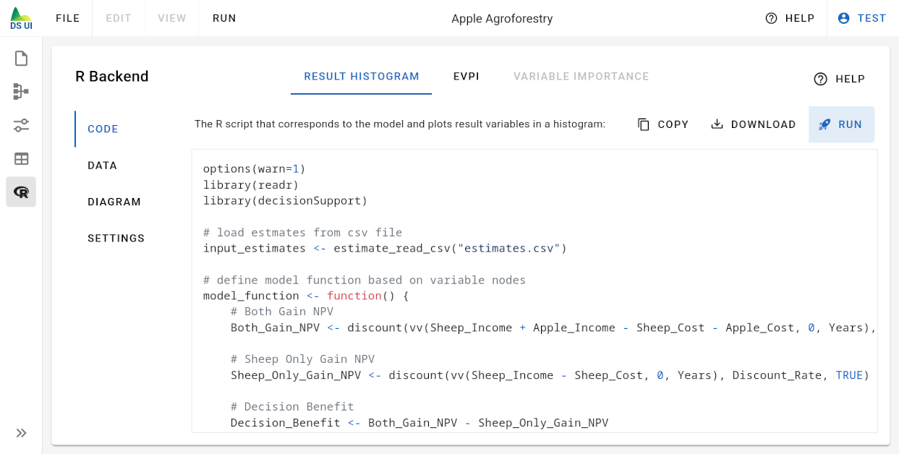

# R Backend

The "R Backend" page shows R code that corresponds to your model, and allows to run the Monte Carlo simulation for your model in the R backend using the [decisionSupport](https://cran.r-project.org/web/packages/decisionSupport/index.html) CRAN package:



There are currently two variants of R code that is generated:

- R code for generating the result histogram
- R code for calculating the expected value of perfect information (EVPI)

For each variant you can see:

- the generated R code
- the data that was calculated by the R script
- a visualization of the data
- additional settings

In order to run the Monte Carlo simulation for your model with the R backend, you first need to create and login to an account.

## R Code Tab

The R code is generated by transforming each node from the model editor into one or multiple corresponding R code statements. Each node is represented by a variable in the R code. For example, an operation node that defines the variable as `Total_Income` by adding both `Apple_Income` and `Sheep_Income` is converted to the corresponding R code statement:

```
Total_Income <- Apple_Income + Sheep_Income
```

Variable names may only contain regular letters (`a-z`, `A-Z`), numbers (`0-9`) or the underscore character (`_`). All other characters as well as spaces are removed.

Only nodes that are somehow involved in the calculation of a result node is translated into R code statements, except for estimate nodes, which do not generate any R code and are included through the input CSV file.

All generated statements are wrapped in an R-function called `model_function`. This function is then provided to the [decisionSupport](https://cran.r-project.org/web/packages/decisionSupport/index.html) package to be used for the Monte Carlo simulation.

## Data Tab

The data tab shows the contents of the `results.csv` file generated from the corresponding R code.

## Diagram Tab

The diagram tab visualizes the data of the `results.csv` file generated from the corresponding R code.

## Settings Tab

The settings tab allows changing some basic settings:

- "Monte Carlo Runs" - The number of Monte Carlo runs that are calculated in the R backend.

- "Histogram Bins" - The targeted number of histogram bins that is calculated to visualize the result histogram.

- "Maximum R-Script Runtime" - The number of seconds that the generated R code is allowed to run before it will be forcefully stopped. Depending on the complexity of your model and the CPU performance of the server machine, the R script will take more or less time to finish simulating all Monte Carlo runs. Please adjust this timeout appropriately.

> Note: In case you are accessing the Decision Support UI on a remote server, the server administrator might have set
> stricter limits for any of these settings. In this case, choosing a higher value will result in an error message.
